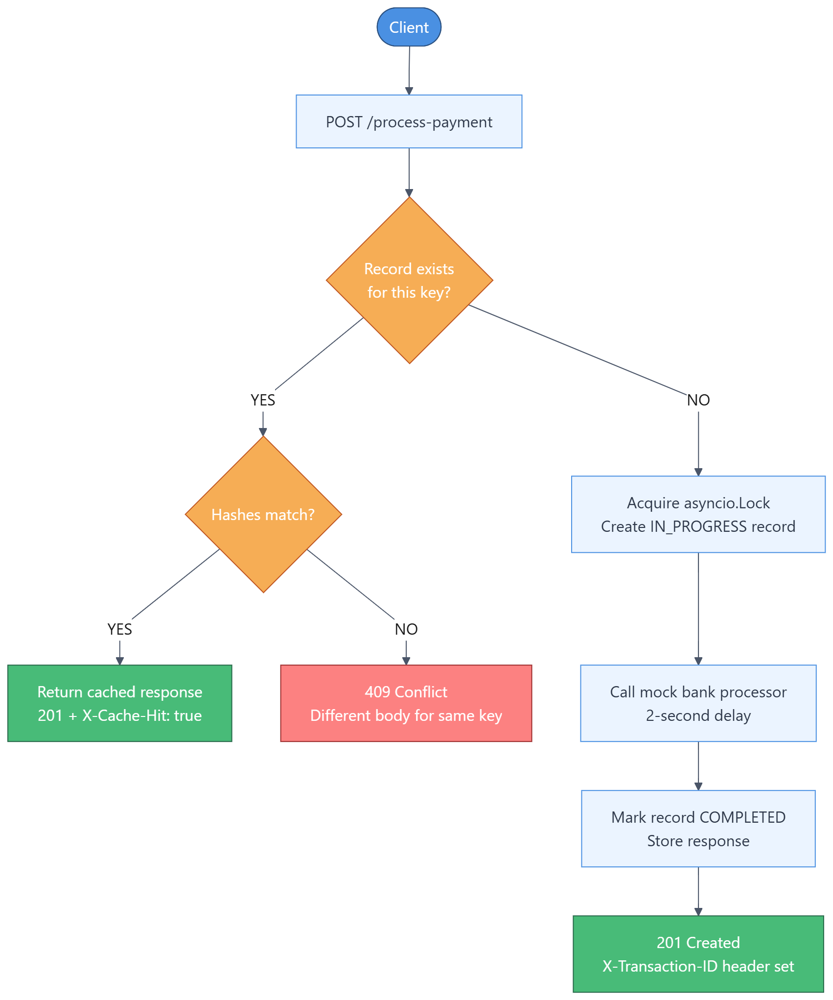
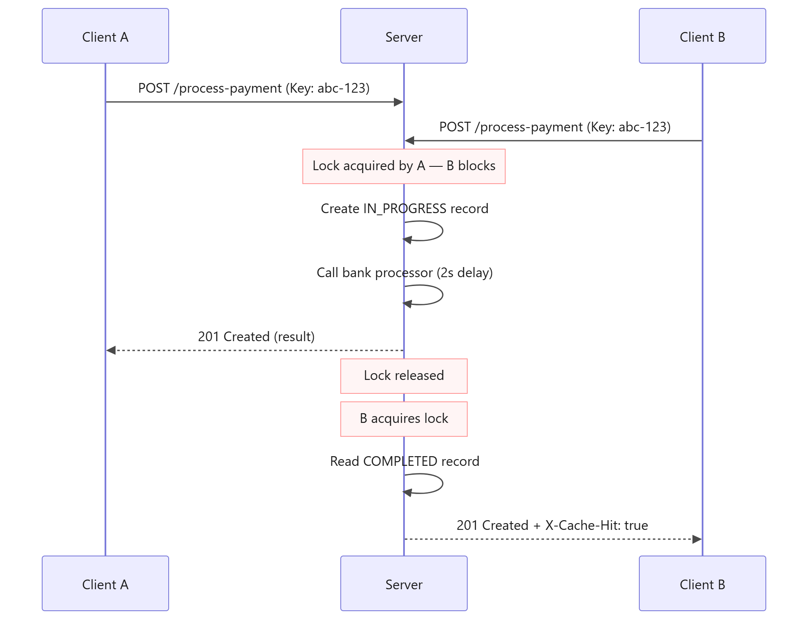

# FinSafe Idempotency API

A payment processing API with strict idempotency guarantees. Prevents double charges on network retries using per-key locking and SHA-256 payload fingerprinting.

**Live API**: https://finsafe-idempotency-api.onrender.com
**Swagger UI**: https://finsafe-idempotency-api.onrender.com/docs

## Architecture Diagram

### Request Flow



Every incoming request is fingerprinted with SHA-256. If the key is new, the payment is processed (2-second bank delay), stored in Redis, and a **201** is returned. If the key already exists and the hash matches, the stored response is returned instantly with `X-Cache-Hit: true`. If the hash differs, a **409 Conflict** is raised — the key is locked to its original payload to prevent fraud or accidental tampering.


### Race Condition — Concurrent Duplicate Requests



When two requests with the same key arrive at the same time, the per-key `asyncio.Lock` ensures only one proceeds. Request A acquires the lock and runs the bank call. Request B blocks until A completes, then reads the COMPLETED record from Redis and returns it directly — same response, same `transaction_id`, no double charge.


## Setup Instructions

### Prerequisites

- Python 3.10 or higher
- An [Upstash Redis](https://upstash.com/) account (free tier is enough) — provides a managed Redis with a `rediss://` connection URL
- `uv` package manager (recommended) — [install here](https://docs.astral.sh/uv/getting-started/installation/)
- Or plain `pip` works too

### 1. Clone the repository

```bash
git clone `https://github.com/placidepa/AmaliTech-DEG-Project-based-challenges.git`
cd backend/Idempotency-gateway
```

### 2. Create and activate a virtual environment

```bash
uv venv
```

Activate it:

```bash
# Windows (PowerShell):
.venv\Scripts\activate

# Windows (Command Prompt):
.venv\Scripts\activate.bat

# macOS / Linux:
source .venv/bin/activate
```

### 3. Install dependencies

```bash
# With uv (recommended):
uv pip install -r requirements.txt

# Or with pip:
pip install -r requirements.txt
```

### 4. Configure Upstash Redis

Create a `.env` file in the project root using the values from your Upstash console (**Redis > REST API**):

```
UPSTASH_REDIS_REST_URL=https://<user-host>.upstash.io
UPSTASH_REDIS_REST_TOKEN=<user-token>
```

The app constructs the `rediss://` connection URL automatically from these two variables.

### 5. Start the server

```bash
uvicorn main:app --app-dir app --reload
```

Expected output:

```
INFO:     Started server process
INFO:     Waiting for application startup.
INFO:     FinSafe Idempotency API starting up...
INFO:     Application startup complete.
INFO:     Uvicorn running on http://127.0.0.1:8000 (Press CTRL+C to quit)
```

### 6. Explore

- **Swagger UI**: http://127.0.0.1:8000/docs
- **Health check**: http://127.0.0.1:8000/

### Optional: Enable debug logging

Add to your `.env`:

```
DEBUG=true
```

Restart the server for more verbose logs.


### Running Tests

Tests use `fakeredis` — no real Redis or Upstash credentials needed.

```bash
pip install -r requirements.txt
pytest tests/ -v
```


### Alternative: Run with Docker Compose

Requires a `.env` file with `UPSTASH_REDIS_REST_URL` set (the compose file loads it automatically).

```bash
docker-compose up --build
```

- **Swagger UI**: http://localhost:8000/docs
- **Health check**: http://localhost:8000/


## API Documentation

### Base URL

```
http://127.0.0.1:8000
```


### GET `/`

Health check.

**Response `200 OK`:**
```json
{
  "status": "healthy",
  "service": "FinSafe Idempotency API",
  "version": "1.0.0"
}
```


### POST `/process-payment`

Submit a payment for processing with idempotency guarantees.

**Headers:**

| Header            | Required | Description                                       |
|-------------------|----------|---------------------------------------------------|
| `Idempotency-Key` | Yes      | Unique client-generated key (UUID v4 recommended) |
| `Content-Type`    | Yes      | `application/json`                                |

**Request body:**

```json
{
  "amount": 100.0,
  "currency": "GHS"
}
```

| Field      | Type   | Rules                                                                           |
||--||
| `amount`   | float  | Must be greater than 0                                                          |
| `currency` | string | Exactly 3 characters, ISO 4217 (e.g. GHS, USD, RWF). Normalised to uppercase.  |

**Response body (`201 Created`):**

```json
{
  "transaction_id": "f47ac10b-58cc-4372-a567-0e02b2c3d479",
  "status": "success",
  "message": "Charged 100.0 GHS",
  "amount": 100.0,
  "currency": "GHS",
  "timestamp": "2026-05-23T10:30:00.123456+00:00"
}
```

**Response headers:**

| Header             | Present when                   | Value                    |
|--|--|--|
| `X-Transaction-ID` | Every successful response      | UUID of the transaction  |
| `X-Cache-Hit`      | Duplicate (replayed) requests  | `true`                   |

**Status codes:**

| Code  | Scenario                                                         |
|-||
| `201` | First request — payment charged and stored                       |
| `201` | Duplicate request — cached result replayed (`X-Cache-Hit: true`) |
| `409` | Same key reused with a different request body                    |
| `422` | Validation error — invalid amount, bad currency, missing header  |


### Example curl commands

**First payment (201):**
```bash
curl -X POST http://127.0.0.1:8000/process-payment \
  -H "Content-Type: application/json" \
  -H "Idempotency-Key: test-key-001" \
  -d '{"amount": 100, "currency": "GHS"}'
```

**Retry same request (201 + X-Cache-Hit: true):**
```bash
curl -v -X POST http://127.0.0.1:8000/process-payment \
  -H "Content-Type: application/json" \
  -H "Idempotency-Key: test-key-001" \
  -d '{"amount": 100, "currency": "GHS"}'
```

**Fraud attempt — same key, different amount (409):**
```bash
curl -X POST http://127.0.0.1:8000/process-payment \
  -H "Content-Type: application/json" \
  -H "Idempotency-Key: test-key-001" \
  -d '{"amount": 999, "currency": "GHS"}'
```

**Missing header (422):**
```bash
curl -X POST http://127.0.0.1:8000/process-payment \
  -H "Content-Type: application/json" \
  -d '{"amount": 100, "currency": "GHS"}'
```


## Design Decisions

**1. Per-key `asyncio.Lock` for race-condition safety**
The lock is acquired before reading the store. If Request A holds it while the bank call runs, Request B blocks at `async with lock`. When A finishes and releases the lock, B reads the now-COMPLETED record and returns it as a cache hit — no double charge, no 409.

**2. SHA-256 payload fingerprinting with `sort_keys=True`**
The request body is serialised with `json.dumps(sort_keys=True)` before hashing. This ensures `{"b": 2, "a": 1}` and `{"a": 1, "b": 2}` produce the same fingerprint and do not cause false 409 conflicts on retries.

**3. Currency normalised to uppercase**
`"ghs"` and `"GHS"` are treated as the same payload. Without this, a retry that differs only in currency case would fail the hash check and return a spurious 409.

**4. Status code 201 on both first request and cache hit**
The rubric requires the server to return the exact same status code as the first successful request. The `X-Cache-Hit: true` header is the signal that distinguishes a replayed response from a fresh one.

**5. Upstash Redis as the backing store**
All idempotency records are persisted in Upstash Redis (a managed, serverless Redis). Each key is stored with a 24-hour TTL set natively via Redis `EX` — no background cleanup loop needed. The store interface (`get_record`, `create_record`, `complete_record`) is isolated in `services/store.py`, so swapping to a different Redis provider is a one-line config change. Tests bypass the real connection entirely using `fakeredis`.

**6. Global exception handler**
An unhandled exception returns a clean `500` JSON response instead of leaking a Python stack trace to the client — important for any public-facing financial API.


## Developer's Choice — `X-Transaction-ID` Header

**What it is:** Every successful payment response includes an `X-Transaction-ID` response header containing the UUID generated by the bank processor.

**Why it matters:** In a real fintech system, clients need a stable reference ID to:
- Reconcile payments against their own records
- Open support tickets ("transaction ID: abc-123 was charged but not reflected")
- Audit logs and compliance reporting

Without it, the client would have to parse the response body every time to extract the ID. A dedicated header makes it accessible with a single `response.headers["X-Transaction-ID"]` lookup, consistent across both fresh and cached responses.
